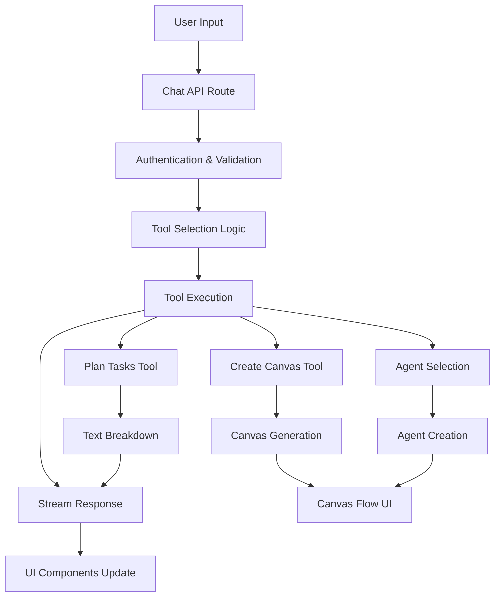

# AI Chatbot Message Flow & Toolcall Documentation

## Table of Contents
1. [Overview](#overview)
2. [Architecture](#architecture)
3. [Core Components](#core-components)
4. [Message Flow Patterns](#message-flow-patterns)
5. [Tool Call Workflows](#tool-call-workflows)
6. [Canvas System](#canvas-system)
7. [Stream Events](#stream-events)
8. [User Journey Examples](#user-journey-examples)
9. [Performance Optimizations](#performance-optimizations)
10. [Development Guidelines](#development-guidelines)

## Overview

This AI chatbot application implements a sophisticated real-time streaming architecture that enables dynamic task planning, visual workflow management, and AI agent coordination. The system processes user messages through a tool selection mechanism, executes appropriate AI tools, and streams responses back to create interactive experiences.

## Architecture

### High-Level Flow


### System Components
- **Chat API**: Central orchestration layer (`app/(chat)/api/chat/route.ts`)
- **Tool System**: AI-powered utilities for task management
- **Canvas System**: Interactive visual workflow interface
- **Agent System**: Dynamic AI agent creation and execution
- **Streaming Layer**: Real-time data flow with multiple event types

## Core Components

### 1. Chat API Route (`app/(chat)/api/chat/route.ts`)

**Responsibilities:**
- User authentication and rate limiting
- Tool selection based on model capabilities
- Stream management and coordination
- Error handling and recovery

**Key Configuration:**
```typescript
experimental_activeTools: selectedChatModel === 'chat-model-reasoning' 
  ? [] 
  : [
      'getWeather',
      'planTasks', 
      'createCanvas',
      'createDocument',
      'updateDocument',
      'requestSuggestions'
    ]
```

**Stream Setup:**
```typescript
const stream = createUIMessageStream({
  execute: ({ writer: dataStream }) => {
    const result = streamText({
      model: myProvider.languageModel(selectedChatModel),
      experimental_transform: smoothStream({ chunking: 'word' }),
      tools: {
        planTasks: planTasks({ session, dataStream }),
        createCanvas: createCanvas({ session, dataStream }),
        // ... other tools
      }
    });
  }
});
```

### 2. Data Stream Handler (`components/data-stream-handler.tsx`)

**Purpose:** Processes all streaming events and manages artifact state

**Event Processing Flow:**
```typescript
switch (streamPart.type) {
  case 'data-id':
    // Set artifact identifier
  case 'data-kind':
    // Specify artifact type (canvas, text, code)
  case 'data-textDelta':
    // Handle incremental content updates
  case 'data-clear':
    // Clear previous content
  case 'data-finish':
    // Finalize stream processing
}
```

## Message Flow Patterns

### 1. Standard Tool Call Pattern
```
User Message → Model Processing → Tool Selection → Tool Execution → Stream Response
```

**Example Flow:**
1. User: *"Plan a marketing campaign"*
2. AI determines `planTasks` tool is appropriate
3. Tool executes with project description
4. Response streams back as `data-textDelta` events
5. UI updates incrementally as text arrives

### 2. Document Creation Pattern
```
Tool Call → Document Initialization → Content Generation → Stream Events → UI Rendering
```

**Stream Event Sequence:**
1. `data-kind`: Specify artifact type
2. `data-id`: Unique document identifier
3. `data-title`: Document title
4. `data-clear`: Clear existing content
5. `data-textDelta`: Incremental content (can be multiple)
6. `data-finish`: Completion signal

### 3. Canvas Interaction Pattern
```
Canvas Creation → Task Generation → Agent Assignment → Agent Execution → Summary
```

**State Transitions:**
- Tasks: `pending` → `recruiting` → `in-progress` → `completed`
- Agents: `created` → `assigned` → `executed`
- Canvas: `initializing` → `streaming` → `interactive`

## Tool Call Workflows

### Plan Tasks Tool (`lib/ai/tools/plan-tasks.ts`)

**Purpose:** Creates structured task breakdowns using AI

**Execution Flow:**
```typescript
1. Receive project description from user
2. Generate AI prompt template
3. Stream LLM response word-by-word
4. Return structured breakdown with canvas offer
```

**Stream Implementation:**
```typescript
for await (const delta of fullStream) {
  if (delta.type === 'text') {
    responseText += delta.text;
    dataStream.write({
      type: 'data-textDelta',
      data: delta.text,
      transient: true,
    });
  }
}
```

**Response Format:**
```typescript
{
  projectDescription: string,
  taskBreakdown: string, // Formatted text
  message: string // Next step suggestion
}
```

### Create Canvas Tool (`lib/ai/tools/create-canvas.ts`)

**Purpose:** Initializes interactive visual canvases

**Execution Steps:**
1. Generate unique canvas ID
2. Initialize document stream with metadata
3. Delegate to canvas document handler
4. Return creation confirmation

**Document Stream Initialization:**
```typescript
dataStream.write({ type: 'data-kind', data: 'canvas' });
dataStream.write({ type: 'data-id', data: id });
dataStream.write({ type: 'data-title', data: title });
dataStream.write({ type: 'data-clear', data: null });
```

### Canvas Server Handler (`artifacts/canvas/server.ts`)

**Purpose:** AI-powered task generation and streaming

**Task Generation Process:**
```typescript
1. Create AI prompt for task breakdown
2. Generate JSON structure via LLM
3. Parse and validate response
4. Stream tasks incrementally with delays
5. Return final data structure
```

**Streaming Pattern:**
```typescript
for (let i = 0; i < tasks.length; i++) {
  const uniqueTaskId = generateUUID();
  const taskWithId = { ...task, id: uniqueTaskId };
  
  dataStream.write({
    type: 'data-textDelta',
    data: JSON.stringify({ newTask: taskWithId }),
    transient: true,
  });
  
  // Visual delay for streaming effect
  if (i < tasks.length - 1) {
    await new Promise(resolve => 
      setTimeout(resolve, TASK_STREAMING_DELAY)
    );
  }
}
```

**Generated Task Structure:**
```typescript
interface Task {
  id: string;        // Server-generated UUID
  title: string;     // AI-generated task name
  description: string; // Detailed task description
  status: 'pending' | 'in-progress' | 'completed' | 'recruiting';
}
```

## Canvas System

### Canvas Flow Component (`components/canvas-flow.tsx`)

**Purpose:** ReactFlow-based visual interface for workflow management

**Node Types:**
```typescript
const nodeTypes = {
  taskDecompositionTitle: TaskDecompositionTitleNode,
  task: TaskNode,
  agentCard: AgentCardNode, 
  response: ResponseNode,
  summary: SummaryNode,
};
```

**Node Layout Algorithm:**
```typescript
// Vertical task chain with horizontal agent/response branches
const LAYOUT_CONSTANTS = {
  VERTICAL_SPACING: { TASKS: 200, AGENTS_RESPONSES: 250 },
  HORIZONTAL_SPACING: { TASKS_TO_AGENTS: 400, AGENTS_TO_RESPONSES: 400 },
  INITIAL_POSITIONS: {
    TITLE: { x: 50, y: 50 },
    FIRST_TASK: { x: 50, y: 200 },
    FIRST_AGENT: { x: 450, y: 200 },
    FIRST_RESPONSE: { x: 850, y: 200 }
  }
};
```

**Edge Types & Styling:**
```typescript
const EDGE_STYLES = {
  TASK_CHAIN: { stroke: '#3b82f6', strokeWidth: 3 }, // Blue, solid
  TASK_TO_AGENT: { stroke: '#10b981', strokeWidth: 3, strokeDasharray: '3,3' }, // Green, dashed  
  AGENT_TO_RESPONSE: { stroke: '#f59e0b', strokeWidth: 3 }, // Orange, solid
  TASK_TO_SUMMARY: { stroke: '#8b5cf6', strokeWidth: 3, strokeDasharray: '5,5' } // Purple, dashed
};
```

### Canvas Client Handler (`artifacts/canvas/client.tsx`)

**Purpose:** Client-side canvas state management and user interactions

**Stream Processing:**
```typescript
onStreamPart: ({ streamPart, setMetadata }) => {
  if (streamPart.type === 'data-textDelta') {
    try {
      const parsedData = JSON.parse(streamPart.data);
      if (parsedData.newTask) {
        setMetadata(metadata => ({
          ...metadata,
          tasks: [...(metadata?.tasks || []), parsedData.newTask]
        }));
      }
    } catch (error) {
      // Normal during incomplete JSON streaming
    }
  }
}
```

**Agent Request Workflow:**
```typescript
const handleRequestAgentSelection = async (taskDescription, taskId) => {
  // 1. Update task status to recruiting
  setTaskStatus(taskId, 'recruiting');
  
  // 2. Call agent selection API
  const agentData = await requestAgentSelection(taskDescription);
  
  // 3. Process agent (name truncation, ID assignment)
  const agent = { ...agentData, taskId };
  
  // 4. Add agent and reset task status
  addAgent(agent);
  setTaskStatus(taskId, 'pending');
};
```

### Agent System

#### Agent Selection API (`app/(chat)/api/agent-selection/route.ts`)

**Purpose:** AI-powered agent creation based on task requirements

**Agent Generation Process:**
```typescript
1. Receive task description
2. Generate specialized prompt for agent creation
3. Use LLM to create agent configuration
4. Parse JSON response and add UUID
5. Return agent data to client
```

**Agent Creation Constraints:**
```typescript
const CONSTRAINTS = {
  AGENT_NAME_MAX_LENGTH: 15,
  AGENT_DESCRIPTION_MAX_WORDS: 10,
  CAPABILITIES_COUNT: 3
};
```

**Generated Agent Structure:**
```typescript
interface Agent {
  id: string;              // Server-generated UUID
  name: string;            // ≤15 characters
  description: string;     // ≤10 words
  capabilities: string[];  // Exactly 3 single-word capabilities
  taskId?: string;        // Associated task ID
  pricingUsdt?: number;   // Simulated pricing
  walletAddress?: string; // Simulated Web3 address
}
```

#### Agent Execution Simulation

**Response Generation Logic:**
```typescript
const generateResponseContent = (agentName, capabilities) => {
  if (capabilities.includes('Web Scraping')) {
    return `${agentName} execution completed. Collected data from 15 sources...`;
  } else if (capabilities.includes('Statistical Analysis')) {
    return `${agentName} execution completed. Processed 2,847 data points...`;
  }
  // ... more capability-specific responses
};
```

**Streaming Simulation:**
```typescript
const streamInterval = setInterval(() => {
  if (currentContent.length < responseContent.length) {
    currentContent += responseContent[currentContent.length];
    updateResponse(responseId, currentContent);
  } else {
    clearInterval(streamInterval);
    setTaskStatus(taskId, 'completed');
  }
}, 30); // 30ms per character
```

## Stream Events

### Event Types Reference

| Event Type | Purpose | Data Structure | Transient | Usage |
|------------|---------|---------------|-----------|-------|
| `data-textDelta` | Incremental text/JSON updates | `{data: string}` | `true` | All streaming content |
| `data-kind` | Artifact type specification | `{data: 'canvas'\|'text'\|'code'}` | `true` | Document initialization |
| `data-id` | Unique document identifier | `{data: string}` | `true` | Document tracking |
| `data-title` | Content title/name | `{data: string}` | `true` | Document metadata |
| `data-clear` | Clear previous content | `{data: null}` | `true` | Content reset |
| `data-finish` | Stream completion signal | `{data: null}` | `true` | Finalization |
| `data-suggestion` | UI interaction suggestions | `{data: Suggestion}` | `false` | User guidance |

### Stream Event Processing

**Client-Side Handler Pattern:**
```typescript
const processStreamEvent = (streamPart) => {
  switch (streamPart.type) {
    case 'data-textDelta':
      // Handle incremental content
      if (isValidJSON(streamPart.data)) {
        const parsed = JSON.parse(streamPart.data);
        updateArtifactData(parsed);
      } else {
        appendTextContent(streamPart.data);
      }
      break;
      
    case 'data-kind':
      setArtifactType(streamPart.data);
      break;
      
    case 'data-finish':
      finalizeArtifact();
      break;
  }
};
```

## User Journey Examples

### Example 1: Task Planning to Canvas Creation

```
Step 1: User Input
User: "Help me plan a marketing campaign for a new product"

Step 2: Tool Selection & Execution
→ AI selects planTasks tool
→ Generates comprehensive task breakdown
→ Streams response word-by-word
→ Offers canvas creation option

Step 3: Canvas Creation
User: "Create a visual canvas for this"
→ createCanvas tool selected
→ Canvas document initialized with metadata
→ AI generates structured task JSON
→ Tasks stream in with visual delays (800ms each)

Step 4: Interactive Canvas
→ ReactFlow canvas renders with task nodes
→ User can drag nodes, view details
→ "Request Agent" buttons available on tasks
```

### Example 2: Full Agent Workflow

```
Step 1: Canvas Interaction
User clicks "Request Agent" on "Market Research" task
→ Task status: pending → recruiting
→ Agent selection API called with task description

Step 2: Agent Generation
→ AI creates specialized "MarketResearch" agent
→ Capabilities: ["Research", "Analysis", "Reporting"]  
→ Agent appears as connected node in canvas
→ Task status: recruiting → pending

Step 3: Agent Execution
User clicks "Execute" on agent
→ Web3-style transaction dialog appears
→ Shows agent cost, wallet details, network fees
→ User confirms execution

Step 4: Response Generation
→ Task status: pending → in-progress
→ Response streams character-by-character
→ Content based on agent capabilities
→ Task status: in-progress → completed

Step 5: Summary Generation
User clicks "Generate Summary"
→ Aggregates all agent responses
→ Creates executive summary with findings
→ Provides actionable recommendations
```

### Example 3: Multi-Task Workflow

```
Canvas: "E-commerce Platform Development"

Tasks Generated:
1. User Authentication System (Status: completed)
   └── Agent: AuthExpert → Response: "JWT implementation with OAuth2..."
   
2. Product Catalog System (Status: in-progress) 
   └── Agent: DatabaseDev → Response: streaming...
   
3. Payment Integration (Status: pending)
   └── [Request Agent button available]
   
4. Admin Dashboard (Status: pending)
   └── [Request Agent button available]

Summary: Available after ≥1 agent response
```

## Performance Optimizations

### Streaming Strategies

**1. Chunked Processing**
```typescript
// Word-level streaming for natural text flow
experimental_transform: smoothStream({ chunking: 'word' })
```

**2. Visual Delays**
```typescript
// Staggered task appearance for better UX
await new Promise(resolve => 
  setTimeout(resolve, TASK_STREAMING_DELAY)
);
```

**3. Incremental Updates**
```typescript
// Add tasks one by one instead of batch updates
setMetadata(metadata => ({
  ...metadata,
  tasks: [...(metadata?.tasks || []), newTask]
}));
```

### State Management

**1. Position Persistence**
```typescript
// Maintain node positions during updates
const nodePositionsRef = useRef<Map<string, {x: number, y: number}>>();

const onNodeDragStop = (event, node) => {
  nodePositionsRef.current.set(node.id, node.position);
};
```

**2. Debounced Saves**
```typescript
// Prevent excessive database writes
useEffect(() => {
  const saveTimeout = setTimeout(() => {
    if (contentChanged) {
      onSaveContent(newContent, true); // debounced = true
    }
  }, 1000);
  
  return () => clearTimeout(saveTimeout);
}, [content]);
```

**3. Efficient Re-renders**
```typescript
// Memoize expensive calculations
const memoizedNodes = useMemo(() => {
  return generateNodes(tasks, agents, responses);
}, [tasks, agents, responses]);
```

### Memory Management

**1. Stream Context**
```typescript
// Optional Redis-backed stream resumption
const streamContext = createResumableStreamContext({
  waitUntil: after,
});
```

**2. Component Cleanup**
```typescript
// Clear intervals on unmount
useEffect(() => {
  return () => {
    if (streamInterval.current) {
      clearInterval(streamInterval.current);
    }
  };
}, []);
```

## Development Guidelines

### Adding New Tools

**1. Tool Creation Pattern**
```typescript
// lib/ai/tools/my-new-tool.ts
export const myNewTool = ({ session, dataStream }) =>
  tool({
    description: 'Tool description for AI selection',
    inputSchema: z.object({
      parameter: z.string().describe('Parameter description'),
    }),
    execute: async ({ parameter }) => {
      // Tool logic here
      
      // For streaming responses:
      dataStream.write({
        type: 'data-textDelta',
        data: 'incremental content',
        transient: true,
      });
      
      return { result: 'tool output' };
    },
  });
```

**2. Tool Registration**
```typescript
// app/(chat)/api/chat/route.ts
tools: {
  // ... existing tools
  myNewTool: myNewTool({ session, dataStream }),
}

experimental_activeTools: [
  // ... existing tools
  'myNewTool',
]
```

### Extending Canvas Features

**1. New Node Types**
```typescript
// components/canvas-flow.tsx
const MyCustomNode = ({ data }) => (
  <Card className="custom-node-styling">
    {/* Custom node content */}
  </Card>
);

const nodeTypes = {
  // ... existing types
  myCustomType: MyCustomNode,
};
```

**2. Canvas Metadata Extension**
```typescript
// artifacts/canvas/client.tsx
interface CanvasArtifactMetadata {
  // ... existing fields
  myNewField: MyNewType[];
}
```

### Stream Event Handling

**1. New Event Types**
```typescript
// Add to data-stream-handler.tsx
case 'my-custom-event':
  setArtifact(draft => {
    draft.customData = streamPart.data;
  });
  break;
```

**2. Event Creation**
```typescript
// In tool or server handler
dataStream.write({
  type: 'my-custom-event',
  data: { customField: 'value' },
  transient: true,
});
```

### Error Handling Patterns

**1. Tool Error Handling**
```typescript
try {
  const result = await someOperation();
  return { success: true, data: result };
} catch (error) {
  console.error('Tool error:', error);
  return { 
    success: false, 
    error: error.message,
    fallback: 'User-friendly fallback message'
  };
}
```

**2. Stream Error Recovery**
```typescript
onError: (error) => {
  console.error('Stream error:', error);
  // Log error for monitoring
  // Provide user-friendly message
  return 'Something went wrong. Please try again.';
}
```

### Testing Considerations

**1. Tool Testing**
- Mock dataStream.write calls
- Verify proper parameter validation
- Test error conditions and recovery

**2. Canvas Testing**  
- Test incremental task loading
- Verify agent assignment workflows
- Test node interaction patterns

**3. Stream Testing**
- Mock stream events and verify UI updates
- Test error recovery mechanisms
- Verify proper cleanup on component unmount

This documentation provides a comprehensive guide to understanding and extending the AI chatbot's sophisticated streaming architecture and interactive workflow system.