# Canvas System - Complete Flow Diagrams

## Master Architecture Overview

### Complete System Architecture

```mermaid
graph TB
    subgraph "🌐 External Services"
        EXT[External A2A Agent API]
        EXT2[Task Decomposition Service]
    end

    subgraph "🛠️ Application Backend"
        A2A[A2A Tool requestA2AAgent]
        HANDLER[Canvas Server Handler]
        DB[(Database)]
        GLOBAL[Global Canvas Data Store]
    end

    subgraph "🎨 AI SDK v5 Layer"
        SDK[AI SDK Streaming Pipeline]
        ARTIFACTS[Artifact System]
        TOOLS[Tool Call Management]
    end

    subgraph "🖥️ Frontend Components"
        CANVAS_ART[Canvas Artifact Client]
        CANVAS_COMP[Canvas Component]
        CANVASFLOW[CanvasFlow Visualization]
        MESSAGE[Message Component]
    end

    subgraph "👤 User Interface"
        CHAT[Chat Interface]
        SIDEPANEL[Canvas Side Panel]
        HISTORY[Chat History Buttons]
    end

    CHAT --> A2A
    A2A <--> EXT
    EXT <--> EXT2
    A2A --> DB
    A2A --> GLOBAL
    A2A --> SDK
    SDK --> ARTIFACTS
    ARTIFACTS --> HANDLER
    HANDLER --> GLOBAL
    HANDLER --> SDK
    SDK --> CANVAS_ART
    CANVAS_ART --> CANVAS_COMP
    CANVAS_COMP --> CANVASFLOW
    CANVASFLOW --> SIDEPANEL
    CANVAS_ART --> MESSAGE
    MESSAGE --> HISTORY
    DB --> HANDLER

    style CHAT fill:#e3f2fd
    style A2A fill:#fff3e0
    style HANDLER fill:#e8f5e8
    style CANVAS_ART fill:#e8f5e8
    style CANVASFLOW fill:#4caf50
    style HISTORY fill:#f3e5f5
```



## Core Flow Diagrams

### 1. Canvas Creation Flow (Primary Use Case)

```mermaid
sequenceDiagram
    participant User as 👤 User
    participant Chat as 💬 Chat Interface
    participant A2A as 🤖 A2A Tool
    participant API as 🌐 External A2A API
    participant DB as 💾 Database
    participant Handler as 🛠️ Canvas Handler
    participant Artifact as 🎨 Canvas Artifact
    participant Canvas as 🖼️ Canvas Component
    participant Flow as 📊 CanvasFlow

    User->>Chat: "Plan a 5-day trip to Japan"
    Chat->>A2A: requestA2AAgent({userRequirements, title})

    Note over Chat: Shows "🟣 A2A Agent Planning..."

    A2A->>API: POST /create-tasks
    API-->>A2A: Task decomposition response

    loop For each task
        A2A->>DB: Store task in database
    end

    A2A->>A2A: Transform tasks for Canvas UI
    A2A->>Handler: Store in global.canvasTaskData

    Note over A2A,Handler: AI SDK Artifact Creation Flow
    A2A->>Handler: data-kind: 'canvas'
    A2A->>Handler: data-id, data-title, data-clear
    Handler->>Handler: onCreateDocument() called
    Handler->>Handler: Find global.canvasTaskData
    Handler->>Artifact: data-textDelta (task JSON)
    A2A->>Handler: data-finish

    Artifact->>Artifact: onStreamPart receives JSON
    Artifact->>Artifact: setArtifact(content: JSON)
    Artifact->>Canvas: Pass content prop
    Canvas->>Canvas: JSON.parse(content)
    Canvas->>Flow: Pass tasks & agents
    Flow->>User: ✅ Display visual task interface

    Note over Chat: Shows "✅ Created 'Japan Trip Planning'" button
```



### 2. Chat History Integration Flow


### 3. AI SDK v5 Streaming Pattern

```mermaid
sequenceDiagram
    participant Tool as 🛠️ Any Tool
    participant SDK as ⚙️ AI SDK
    participant Handler as 📝 Document Handler
    participant Artifact as 🎨 Artifact Client
    participant Component as 🖼️ UI Component

    Note over Tool,Handler: Standard AI SDK v5 Flow

    Tool->>SDK: 1. data-kind: 'type'
    Tool->>SDK: 2. data-id: documentId
    Tool->>SDK: 3. data-title: title
    Tool->>SDK: 4. data-clear: null

    SDK->>Handler: 5. onCreateDocument()
    Handler->>Handler: Generate/prepare content
    Handler->>SDK: 6. Stream content via data-*

    Tool->>SDK: 7. data-finish: null
    SDK->>Artifact: 8. onStreamPart(streamData)
    Artifact->>Artifact: 9. setArtifact(content)
    Artifact->>Component: 10. Render with content

    Note over Component: ✅ Content displays immediately

    rect rgb(232, 245, 232)
        Note over Tool,Component: Canvas follows this exact pattern
    end
```



### 4. Task Data Transformation Pipeline


## Error Handling & Edge Cases

### Error Flow Diagram

```mermaid
graph TD
    A[Canvas Creation Request] --> B{A2A Tool Success?}

    B -->|✅ Success| C[Tasks Created]
    B -->|❌ Fail| D[Show A2A Error]

    C --> E{Canvas Handler Available?}
    E -->|✅ Yes| F[Stream Task Data]
    E -->|❌ No| G[Handler Missing Error]

    F --> H{Valid Task Data?}
    H -->|✅ Yes| I[Canvas Renders Successfully]
    H -->|❌ No| J[Show Empty Canvas]

    I --> K[Success Toast Message]
    I --> L[Create Chat Artifact Button]
    I --> M[Enable Task Execution]

    J --> N["Display: No tasks available"]
    G --> O["Error: Canvas handler not found"]
    D --> P["Error: A2A tool failed"]

    style I fill:#4caf50
    style K fill:#4caf50
    style L fill:#f3e5f5
    style M fill:#4caf50
    style G fill:#ffebee
    style O fill:#ffebee
    style P fill:#ffebee
```



### Canvas State Machine


## Performance & Optimization

### Resource Utilization Flow


## Component Interaction Map

### Canvas Ecosystem


## Data Flow Transformations

### Task Data Journey

```mermaid
graph TD
    subgraph "1. External API Response"
        A[Raw A2A Response] --> B[Task Array]
        B --> C["{ id, title, description, status, assignedAgent }"]
    end

    subgraph "2. Database Storage"
        C --> D[Task Database Schema]
        D --> E[Store with contextId]
        E --> F[Link to Canvas Document]
    end

    subgraph "3. Canvas UI Transformation"
        C --> G[UI Task Format]
        G --> H[Status Mapping]
        H --> I[Agent Extraction]
        I --> J[Canvas Task Object]
    end

    subgraph "4. JSON Serialization"
        J --> K[Canvas Data Structure]
        K --> L["{ tasks: [...], documentId: '...', title: '...' }"]
        L --> M[JSON.stringify()]
        M --> N[Ready for Streaming]
    end

    subgraph "5. AI SDK Streaming"
        N --> O[data-textDelta Stream]
        O --> P[Canvas Artifact Receives]
        P --> Q[setArtifact(content: JSON)]
        Q --> R[Content Prop Updated]
    end

    subgraph "6. Component Rendering"
        R --> S[JSON.parse(content)]
        S --> T[Extract tasks array]
        T --> U[Map to CanvasFlow props]
        U --> V[ReactFlow Nodes]
        V --> W[Visual Task Interface]
    end

    style A fill:#e3f2fd
    style E fill:#fff3e0
    style J fill:#ffe0b2
    style O fill:#e8f5e8
    style Q fill:#e8f5e8
    style W fill:#4caf50
```

### Canvas Lifecycle States


## AI SDK v5 Compliance Patterns

### Standard Artifact Pattern Implementation


## Success Metrics & Testing

### User Experience Flow Testing


---

## Diagram Legend

| Color                        | Meaning                | Usage                               |
| ---------------------------- | ---------------------- | ----------------------------------- |
| 🔵 Blue (`#e3f2fd`)          | User Input/Interaction | Starting points, user actions       |
| 🟡 Yellow (`#fff3e0`)        | Data Processing        | Backend processing, transformations |
| 🟢 Green (`#e8f5e8`)         | AI SDK Integration     | Streaming, artifacts, handlers      |
| 🟣 Purple (`#f3e5f5`)        | UI Components          | Visual elements, buttons            |
| ✅ Success Green (`#4caf50`) | Successful Outcomes    | Working features, rendered content  |
| ❌ Error Red (`#ffebee`)     | Error States           | Failures, edge cases                |

## Documentation Index

- **`CANVAS_SYSTEM_OVERVIEW.md`** - High-level architecture and component interactions
- **`CANVAS_ARTIFACT_REFACTOR_PRD.md`** - Complete technical specification with implementation details
- **`CANVAS_FINAL_WORKING_SOLUTION.md`** - Root cause analysis and AI SDK sequence diagrams
- **`CANVAS_CHAT_HISTORY_INTEGRATION.md`** - Chat integration and reopening flows
- **`CANVAS_FLOW_DIAGRAMS.md`** - This comprehensive diagram collection

---

**Status**: Complete Architectural Documentation ✅  
**Pattern**: AI SDK v5 Compliant  
**Date**: January 2024  
**Coverage**: End-to-End System Flows
