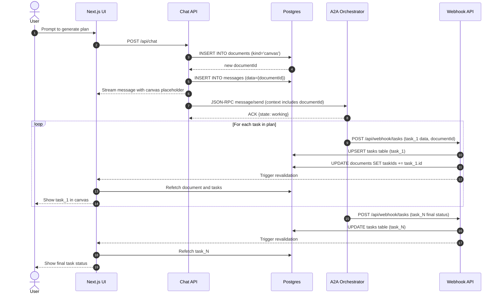

# Feature Requirement Document: A2A Async Agent Refactoring

### 1. Introduction & Goal

This document outlines the requirements for refactoring the existing agent task management system to be fully compliant with the Agent-to-Agent (A2A) communication protocol. The primary goal is to centralize task-related tool logic within an external, A2A-compliant orchestrator agent, moving it out of the Next.js application. The Next.js backend will act as a thin client, relaying user messages to the agent and processing asynchronous updates via webhooks. This refactoring introduces a dedicated `tasks` table and modifies the `documents` table to act as a "canvas" or container for those tasks, providing a more robust, scalable, and standardized architecture.

### 2. Codebase Analysis & Current Architecture

#### 2.1. High-Level Flow

A thorough review of the codebase reveals a well-established, stream-based architecture for agent communication. The agent is invoked via a `planTasks` -> `createTask` -> `updateTask` tool flow, with the frontend rendering progress and results in real-time. This logic is currently embedded within the Next.js application's AI SDK implementation.

#### 2.2. A2A Provider: The Bridge Component

The connection between the Vercel AI SDK and our Python agent is handled by a custom A2A provider. This provider acts as a powerful **translation layer**, allowing the AI SDK to communicate with our Python agent as if it were a standard language model, translating requests and streaming responses between the two standards.

#### 2.3. Current Limitations

The current system uses the generic `documents` table (with a `canvas` type) to store all task and job information directly. This refactoring will separate the concerns, using the `documents` table as a high-level container and introducing a dedicated `tasks` table for the operational details.

### 3. Proposed Refactoring & Architecture

The core of this refactoring is a fundamental shift in architecture. We will move all task-related business logic from the Vercel AI SDK agent running in the Next.js application to an external Python agent that acts as the orchestrator. The Next.js application will no longer define `createTask` or `updateTask` tools; instead, it will use a custom AI SDK provider to communicate with the Python agent.

The new architecture will be as follows:
1.  **Canvas & Message Relay:** When a user initiates a planning request, the Next.js backend creates a `document` of `kind: 'canvas'` to represent the overall plan. It then relays the user message and a reference to this canvas document to the external Python orchestrator agent.
2.  **External Orchestration:** The Python agent (initially a mock, as defined in `python-agent/`) receives the message, decomposes the plan into one or more discrete tasks, and performs all related actions.
3.  **DB Updates via Webhook:** The Python agent communicates task creation, progress, and completion back to the Next.js application by calling a secure webhook endpoint. These webhook calls include a reference to the parent canvas document. The Next.js backend then creates/updates records in the `tasks` table and links them to the `documents` table.
4.  **UI Rendering:** The frontend renders the canvas and its associated tasks, with real-time updates triggered by the webhooks.

### 4. Database Schema Changes

To support the new A2A task-centric architecture, we will introduce a new `tasks` table and modify the existing `documents` and `messages` tables. The `documents` table will continue to store "canvas" documents, which will act as containers referencing the tasks associated with them.

#### 4.1. Task Status Enum
We will define a reusable enum for task statuses that aligns with the A2A protocol specification.
**File:** `lib/db/schema.ts`
```typescript
import { pgEnum, pgTable, text, jsonb, timestamp } from 'drizzle-orm/pg-core';

export const taskStatusEnum = pgEnum('task_status', [
  'submitted',
  'working',
  'input-required',
  'completed',
  'canceled',
  'failed',
  'rejected',
  'auth-required',
  'unknown',
]);
```

#### 4.2. New `tasks` Table
A dedicated `tasks` table will be the system of record for all individual tasks generated by the orchestrator agent. It will store the status, results, and other metadata for each task.
**File:** `lib/db/schema.ts`
```typescript
export const tasks = pgTable('tasks', {
  id: text('id').primaryKey(), // Task ID from A2A Task.id
  contextId: text('context_id').notNull(),
  status: taskStatusEnum('status').notNull().default('submitted'),
  statusMessage: text('status_message'),
  result: jsonb('result'),
  webhookToken: text('webhook_token').notNull(),
  createdAt: timestamp('created_at', { withTimezone: true }).defaultNow().notNull(),
  updatedAt: timestamp('updated_at', { withTimezone: true }).defaultNow().notNull(),
});
```

#### 4.3. `documents` Table Modification
The `documents` table will be modified to link a canvas document to its associated tasks. A new `jsonb` column will store an array of task IDs.
**File:** `lib/db/schema.ts`
```typescript
// In the 'documents' table definition
export const documents = pgTable('documents', {
  // ... existing columns
  taskIds: jsonb('task_ids').$type<string[]>(), // Array of task IDs
});
```

#### 4.4. `messages` Table Modification
To link chat messages to the artifacts they produce (like a task canvas), we will add a `jsonb` data column to the `messages` table.
**File:** `lib/db/schema.ts`
```typescript
// In the 'messages' table definition
export const messages = pgTable('messages', {
  // ... existing columns
  data: jsonb('data'), // To store { artifactType: 'document', documentId: '...' } or similar
});
```

### 5. Developer Experience & Local Testing

To ensure a smooth developer experience, the Python mock agent will be runnable with a single command (`python -m task_agent`). This allows local end-to-end testing of the full flow: a user prompt in the Next.js UI triggers a call to the local Python agent, which then calls the webhook back to the Next.js application to update the database and UI.

### 6. Implementation Plan & Task Checklist

Here is the detailed, incremental plan for executing the refactor. Each phase and task is designed to be implemented in order, providing a clear and traceable path to completion.

---

#### **Phase 1: Backend Foundation**

_The goal of this phase is to prepare the database and backend API to support the new task-centric architecture._

- [ ] **Task 1.1: Update Database Schema (`lib/db/schema.ts`)**
  - [ ] Add the `taskStatusEnum` export as defined in Section 4.1.
  - [ ] Add the `tasks` table definition as specified in Section 4.2.
  - [ ] Add the `taskIds: jsonb('task_ids')` column to the `documents` table as specified in Section 4.3.
  - [ ] Add the `data: jsonb('data')` column to the `messages` table as specified in Section 4.4.

- [ ] **Task 1.2: Apply Database Migration**
  - [ ] Run `pnpm db:generate` to create the migration file.
  - [ ] Review the generated SQL in the new migration file for correctness.
  - [ ] Run `pnpm db:migrate` to apply the changes to the database.

- [ ] **Task 1.3: Create Webhook API Route**
  - [ ] Create a new file: `app/api/webhook/tasks/route.ts`.
  - [ ] Implement a `POST` handler that receives task data (e.g., `{ taskId, documentId, status, result }`).
  - [ ] The handler must validate a secret token from the `Authorization: Bearer <token>` header.
  - [ ] On successful validation, it should `upsert` a record in the `tasks` table and update the `taskIds` array in the corresponding `documents` table record.

---

#### **Phase 2: Decouple Next.js from Tool Logic**

_The goal of this phase is to remove the task-related tool logic from the Next.js application and establish it as a pure message relay to the external agent._

- [ ] **Task 2.1: Remove AI SDK Tool Definitions**
  - [ ] Delete the `lib/ai/tools/create-task.ts` and `lib/ai/tools/update-task.ts` files if they exist.
  - [ ] Remove any references to these tools from the AI SDK agent definition (e.g., in `app/(chat)/api/chat/route.ts`).
  - [ ] The AI SDK agent in the Next.js app should no longer have any `tools` or `tool_choice` configured for task management.

- [ ] **Task 2.2: Implement Custom A2A Provider**
  - [ ] In `lib/ai/a2a-provider.ts` (or a similar new file), implement a custom AI SDK v5 provider that forwards messages to the external Python agent's A2A endpoint (defined by `A2A_AGENT_URL`).
  - [ ] This provider should handle sending the user's message and receiving the initial ACK response from the agent, as detailed in Section 7.

- [ ] **Task 2.3: Update Chat API to Use the Custom Provider**
  - [ ] Modify `app/(chat)/api/chat/route.ts` to use the new A2A custom provider when the "Python Agent (A2A)" model is selected.
  - [ ] When a planning request is received, the route should first create a `document` of `kind: 'canvas'`, then pass the `documentId` in the context of the message to the Python agent.

---

#### **Phase 3: Refactor Frontend & API**

_The goal of this phase is to adapt the frontend components to display data from the new `documents` and `tasks` tables._

- [ ] **Task 3.1: Create Task-Fetching API Route**
  - [ ] Create a new file: `app/api/tasks/[id]/route.ts`.
  - [ ] Implement a `GET` handler that takes a task ID from the URL.
  - [ ] The handler should query the `tasks` table and return the corresponding task object.

- [ ] **Task 3.2: Refactor Canvas Artifact (`components/artifact.tsx`)**
  - [ ] The component will be triggered by a message containing a reference to a `document` of `kind: 'canvas'`.
  - [ ] It should first fetch the canvas document from `/api/documents/[id]`.
  - [ ] From the document, it will get the `taskIds` array.
  - [ ] It will then fetch the data for each task ID (e.g., by calling `/api/tasks/[id]` for each, or a new bulk-fetch endpoint).
  - [ ] The component will then render the UI that showcases all the fetched tasks, updating as webhook events are received.

- [ ] **Task 3.3: Update Message Component (`components/message.tsx`)**
  - [ ] In the component that renders message parts, add a condition to check for a message that references a `document` of `kind: 'canvas'` (e.g., via `message.data.documentId`).
  - [ ] When this condition is met, render a preview component for the canvas artifact, which should link to or open the main `Artifact` view for that document.

---

#### **Phase 4: Implement Python Orchestrator Logic**

_The goal of this phase is to implement the core orchestration logic within the Python mock agent, making it the true executor of tasks._

- [ ] **Task 4.1: Refactor Python Agent to Be the Orchestrator (`python-agent/task_agent/agent_executor.py`)**
  - [ ] Remove the existing logic that generates `toolcall` artifacts for `createTask` and `updateTask`. The agent will now execute these actions directly instead of asking the client to do so.
  - [ ] Implement the `_call_webhook` method to send updates back to the Next.js application's `/api/webhook/tasks` endpoint, as specified in Section 22.

- [ ] **Task 4.2: Implement Task Creation Logic in Python**
  - [ ] The agent's `execute` method will receive a `documentId` in the request context from the Next.js app.
  - [ ] When a user prompt requires task creation, the agent should generate the structure for one or more tasks.
  - [ ] For each task generated, it must call the webhook (`/api/webhook/tasks`). The payload must include the task details (ID, title, etc.) and the `documentId` it belongs to.
  - [ ] The webhook in the Next.js app is responsible for creating the task record and updating the `documents` table to link them.

- [ ] **Task 4.3: Implement Task Execution Logic in Python**
  - [ ] When a task execution is triggered, the agent should simulate the job execution process (e.g., iterating through jobs, simulating work with `asyncio.sleep`).
  - [ ] For each significant step of the execution (e.g., job starting, job completed), the agent must call the webhook to update the task's status and results in the Next.js application's database.
  - [ ] The final execution summary should also be sent via a webhook call.

---

### 7. AI SDK v5 + A2A Integration Details

This section specifies the precise integration between AI SDK v5 and the A2A protocol using our custom provider. The objective is to send messages to a remote A2A orchestrator agent, receive an immediate acknowledgement (ACK) without holding a long-lived HTTP connection, and then receive a webhook notification upon task completion.

#### 7.1. Provider Strategy

- **Custom Provider**: We expose A2A endpoints as a LanguageModelV2 via a custom provider wrapper so the rest of the app can select an "a2a" model like any other model.
- **Model Mapping**: Use a stable alias for the A2A agent URL. In code, `model: a2a(AGENT_URL, settings)` should be selectable via our model selector.
- **Default Settings**:
  - `blocking: false` for non-streaming immediate ACK requests
  - `acceptedOutputModes: ['text/plain', 'application/json']`
  - `pushNotificationConfig: { url, token }` provided on requests to support async webhook notifications

Example custom provider concept (reference): see AI SDK v5 `customProvider` docs [link](https://v5.ai-sdk.dev/docs/reference/ai-sdk-core/custom-provider).

#### 7.2. Messages and Streaming (AI SDK v5)

- AI SDK v5 introduces `UIMessage` and `ModelMessage` types. Always store and handle messages in `UIMessage` form and convert to `ModelMessage` only for model calls. See [Message Overhaul](https://v5.ai-sdk.dev/docs/announcing-ai-sdk-5-beta).
- For chat endpoints, prefer SSE to stream UI parts. However, for A2A we will avoid long-running streams for task execution. We only accept the initial response (ACK) and then rely on webhooks.

#### 7.3. Orchestrator Flow (ACK + Webhook)

1. Client sends `message/send` (non-streaming) with `configuration.blocking = false` and `configuration.pushNotificationConfig` containing the absolute HTTPS webhook `url` and a client-generated `token`.
2. Remote A2A agent immediately returns a JSON-RPC success response with a `Task` object whose `status.state ∈ {submitted, working}`.
3. Backend stores the task in our `tasks` table and surfaces it to the UI.
4. The A2A agent executes jobs asynchronously and, upon completion (or failure), POSTs to our webhook with the final status, artifacts, and any result data.

References:

- A2A ACK and example response [link](https://a2aprotocol.ai/docs/guide/a2a-sample-methods-and-json-responses.html).
- A2A push notifications (webhook) [link](https://a2a-protocol.org/dev/topics/streaming-and-async/).

---

### 8. A2A Request/Response Contracts

#### 8.1. Initial Request (Client → A2A Orchestrator)

- Transport: JSON-RPC 2.0 over HTTPS
- Method: `message/send`
- Params shape (subset):

```json
{
  "message": {
    "kind": "message",
    "messageId": "<uuid>",
    "role": "user",
    "parts": [{ "kind": "text", "text": "<user instruction>" }],
    "contextId": "<uuid>"
  },
  "configuration": {
    "blocking": false,
    "acceptedOutputModes": ["text/plain", "application/json"],
    "pushNotificationConfig": {
      "url": "https://<host>/api/webhook/tasks",
      "token": "<opaque-client-generated-token>"
    }
  }
}
```

Notes:

- `blocking: false` enforces immediate ACK behavior.
- The `token` will be echoed by the server to our webhook caller via `Authorization: Bearer <token>` or in a provider-defined header to allow validation.

#### 8.2. Immediate ACK (A2A → Client)

Expected success response (subset):

```json
{
  "jsonrpc": "2.0",
  "id": "<same-as-request-id>",
  "result": {
    "id": "<task-id>",
    "contextId": "<context-id>",
    "kind": "task",
    "status": {
      "state": "submitted",
      "timestamp": "2024-03-15T11:00:00Z"
    }
  }
}
```

Behavior:

- Treat `state ∈ {submitted, working}` as ACK; write/update the `tasks` row accordingly and render in the UI.

#### 8.3. Webhook Notification (A2A → Backend)

- Method: `POST`
- URL: `/api/webhook/tasks`
- Headers: `Authorization: Bearer <token>` (must match the client-provided token for this task)
- Body (subset):

```json
{
  "id": "<task-id>",
  "documentId": "<parent-document-id>",
  "contextId": "<context-id>",
  "kind": "task",
  "status": { "state": "completed", "timestamp": "2024-03-15T18:30:00Z" },
  "artifacts": [
    {
      "artifactId": "<artifact-uuid>",
      "parts": [{ "kind": "data", "data": { "result": "..." } }]
    }
  ]
}
```

Behavior:

- Validate token, upsert `tasks` status and results, and notify the UI via SWR/cache invalidation or server-push (SSE or revalidation).
- Handle terminal states: `completed`, `failed`, `canceled`, `rejected`.

---

### 9. Database Mapping and Status Lifecycle

#### 9.1. Status Mapping

- A2A `TaskStatus.state` is mapped to our `taskStatusEnum` with values: `submitted | working | input-required | completed | canceled | failed | rejected | auth-required | unknown` (see `docs/A2A_specification.json`).
- Required transitions we support: `submitted → working → (completed | failed | canceled)`.

#### 9.2. Required Columns (recap)

- `id: text` (task id, from A2A Task.id)
- `contextId: text`
- `status: taskStatusEnum`
- `statusMessage: text | null` (from `status.message.parts[text]` if provided)
- `result: jsonb | null` (final artifact or structured result)
- `webhookToken: text` (per-task opaque token we created for validation)
- `createdAt: timestamp with time zone`
- `updatedAt: timestamp with time zone`

Indexes:

- `PRIMARY KEY(id)`
- `INDEX contextId`
- `INDEX status`

RLS (if enabled):

- Ensure a user can only read tasks belonging to their session/tenant.

---

### 10. Backend/API Requirements

#### 10.1. Webhook Route: `app/api/webhook/tasks/route.ts`

- Method: `POST`
- AuthN: Require `Authorization: Bearer <token>`
- Steps:
  - Parse JSON body, validate shape against A2A `Task` subset (id, contextId, status, artifacts?)
  - Verify token matches a stored `webhookToken` for the task
  - Idempotent upsert: update `status`, `statusMessage`, `result`, `updatedAt` in the `tasks` table.
  - Concurrently, update the `documents` table to add the `taskId` to the `taskIds` array for the given `documentId`.
  - Return `204 No Content`
  - On invalid token: `401 Unauthorized`
  - On validation error: `400 Bad Request`

#### 10.2. Task Fetch Route: `app/api/tasks/[id]/route.ts`

- Method: `GET`
- AuthZ: Ensure the task belongs to the requesting user/session
- Returns: The `tasks` row as JSON for UI consumption

#### 10.3. Chat Route Behavior (Server)

- When `model` is `a2a(...)`, the chat route should:
  1. Create a new `document` of `kind: 'canvas'` to get a `documentId`.
  2. Append a `message` to the chat history with `data: { artifactType: 'document', documentId }` so the UI can render the canvas artifact placeholder.
  3. Call the A2A client with the user's prompt, including the `documentId` in the context, `blocking=false`, and `pushNotificationConfig`.

---

### 11. Frontend/UI Requirements

- `components/artifact.tsx` (Canvas):
  - If `artifact.kind === 'canvas'`, fetch from `/api/documents/[id]`.
  - Use the `taskIds` from the document to fetch all associated tasks from `/api/tasks/[id]` (or a bulk endpoint).
  - Show current status for each task; update on webhook-triggered revalidation.

- `components/message.tsx`:
  - If `message.data.artifactType === 'document'`, render a compact canvas preview linking to the full artifact view.

- Revalidation:
  - On webhook, invalidate task and document caches (SWR mutate or route revalidation) so the UI updates without reload.

---

### 12. Provider/Client Changes (Code Alignment)

- `lib/ai/a2a-chat-language-model.ts`:
  - For ACK-only flow, the `sendMessage` call must use `configuration.blocking = false` and include `pushNotificationConfig`.
  - Avoid streaming for long tasks; `doStream` may be used only for short, planning-oriented interactions if needed. Default path for orchestration is non-streaming ACK + webhook.

- `lib/ai/a2a-provider.ts`:
  - Support settings for `pushNotificationUrl` and inject per-call token.
  - Expose `taskMode: true` to ensure the model uses the ACK + webhook path.

---

### 13. Security

- Webhook tokens are per-task, random, and stored in `tasks.webhookToken`.
- Validate `Authorization: Bearer <token>` on webhook, reject mismatches.
- Ensure webhook `url` is HTTPS and publicly reachable.
- Optionally log and rate-limit webhook calls.
- Do not include PII in artifacts unless strictly necessary.

---

### 14. Observability & Failure Modes

- Log initial canvas creation, agent ACK, and webhook completion (task terminal state).
- Retry policy for transient DB or network failures.
- If webhook not received within SLA (e.g., 30 minutes), surface `unknown` or `failed` with a timeout reason and allow manual retry/cancel.

---

### 15. Test Plan (Expanded)

- Unit tests for webhook handler (authz, idempotency, happy path, invalid token, document linking).
- Integration test for chat route creating a canvas document and calling the agent.
- E2E (Playwright):
  - Trigger a prompt that plans tasks.
  - Verify canvas artifact appears.
  - Simulate agent completion by POSTing webhook payloads for multiple tasks.
  - Verify UI updates and task states transition to `completed` within the canvas.

---

### 16. Environment & Configuration

- `A2A_AGENT_URL` (remote orchestrator endpoint)
- `A2A_WEBHOOK_URL` (public HTTPS URL to `/api/webhook/tasks`)
- `A2A_WEBHOOK_TOKEN_TTL` (optional, seconds; if rotating tokens)
- `NEXT_PUBLIC_A2A_ENABLED` (feature flag)

---

### 17. Sequence Diagram



---

### 18. Implementation Notes & References

- AI SDK v5 custom provider and transport: [docs](https://v5.ai-sdk.dev/docs/announcing-ai-sdk-5-beta)
- `customProvider` reference: [docs](https://v5.ai-sdk.dev/docs/reference/ai-sdk-core/custom-provider)
- A2A immediate ACK sample: [docs](https://a2aprotocol.ai/docs/guide/a2a-sample-methods-and-json-responses.html)
- A2A push notifications (async updates): [docs](https://a2a-protocol.org/dev/topics/streaming-and-async/)

Non-goals:

- Long-lived HTTP streams for task execution results. We explicitly avoid keeping the client connection open for long-running tasks.

---

### 19. Message & Context Mapping (AI SDK 5)

Goal: Use AI SDK v5-native message structures, while cleanly mapping A2A Task context.

- **Message Types**: Persist conversation in `UIMessage[]` form and convert to `ModelMessage[]` at request time using `convertToModelMessages` [link](https://v5.ai-sdk.dev/docs/announcing-ai-sdk-5-beta).
- **Context Mapping**:
  - `chatId → contextId`: For any chat session, generate or reuse a stable `contextId`.
  - The `documentId` for the canvas should be passed within the A2A message context so the agent can associate tasks with it.
- **Referencing Artifacts in Messages**:
  - When a canvas is created, append a UI message with a `data` part: `{ artifactType: 'document', documentId: '<id>' }`.
  - Downstream UI components use this reference to fetch the document and its associated tasks.

---

### 20. Data Model Linking: Messages ↔ Documents ↔ Tasks

- **Separate Concerns**: `documents` for the canvas container, `tasks` for operational data, `messages` for chat history.
- **Links**:
- `messages.data.documentId` links a message to the canvas it created.
- `documents.taskIds` (a `jsonb` array) links a canvas to all its tasks.
- `tasks.contextId` links a task back to the overall chat session.
- **Queries**:
  - Fetch a document by `id` to get the list of `taskIds`.
  - Fetch all tasks where `id` is in the `taskIds` array to render the canvas.

---

### 21. Codebase Integration Touchpoints (Evaluation)

- `app/(chat)/api/chat/route.ts`:
  - On a planning prompt, create the canvas `document`, then call the A2A model with the `documentId` in the context.
  - Append a UI message with `{ artifactType: 'document', documentId }`.

- `lib/ai/a2a-chat-language-model.ts`:
  - Ensure the `documentId` is passed through to the Python agent.

- `components/artifact.tsx` (Canvas) and related components:
  - If `artifactType==='document'`, fetch `/api/documents/[id]`, then use `taskIds` to fetch all tasks. Render the complete canvas view.

- DB & Queries (`lib/db/schema.ts`, `lib/db/queries.ts`):
  - Ensure schemas match Section 4.
  - Provide helpers to create the canvas and to handle the webhook logic (upsert task + update document).

---

### 22. Python Orchestrator Mock: Upgrade Plan (Local Flow)

We will implement a minimal JSON-RPC A2A-compatible orchestrator inside `python-agent/` to support the ACK + webhook contract.

#### 22.1. Endpoints

- `POST /jsonrpc` single endpoint handling:
  - `message/send`: return immediate `Task` ACK with `status.state='submitted'| 'working'`.

#### 22.2. Behavior

- On `message/send` with `blocking=false` and `pushNotificationConfig`:
  - Extract `documentId` from the message context.
  - Return ACK immediately.
  - Spawn async worker to simulate planning and execution.
  - For each generated task, POST to the client webhook with the task data and the `documentId`.

#### 22.3. Implementation Tasks (Python)

- [ ] Add simple JSON-RPC server to `python-agent/task_agent/agent_executor.py`.
- [ ] Parse `message/send`, read `configuration.pushNotificationConfig` and the `documentId` from the context.
- [ ] Return immediate `Task` ACK.
- [ ] Simulate long-running work; generate one or more tasks.
- [ ] Implement `_call_webhook(url, token, task, documentId)` using `requests` (or `httpx`).
- [ ] POST each final `Task` with its terminal state to the webhook.
- [ ] Provide `make run` or `python -m task_agent` entry for local startup.

---

### 23. Additional Tasks (Back-End & Front-End)

- Backend
  - [ ] Add `contextId` support for chats; persist mapping `chatId ↔ contextId`.
  - [ ] Implement `app/api/webhook/tasks/route.ts` with token validation and idempotent updates to both `tasks` and `documents` tables.
  - [ ] Implement `app/api/tasks/[id]/route.ts` to fetch tasks.
  - [ ] Generate and store per-task `webhookToken`.

- Frontend
  - [ ] Update message composer/handlers to create the canvas document and include `{ artifactType: 'document', documentId }` data part.
  - [ ] Update canvas to read from `/api/documents/[id]` and then fetch tasks.
  - [ ] SWR mutate or revalidation on webhook.

---

### 24. ISEK (External Agent Framework) Notes

The ISEK framework provides decentralized agent orchestration and P2P discovery. For our local mock we only need a minimal orchestrator, but later we can explore adapting ISEK nodes as remote workers/orchestrators. Key fit points based on repository overview:

- ISEK agents can integrate various LLM backends and expose protocol layers for inter-agent communication, aligning with our A2A approach [repo](https://github.com/isekOS/ISEK).
- For now, we’ll keep our Python mock lightweight and A2A-focused. Future work could wrap an ISEK agent to implement the same JSON-RPC `message/send` semantics and webhook callbacks.
