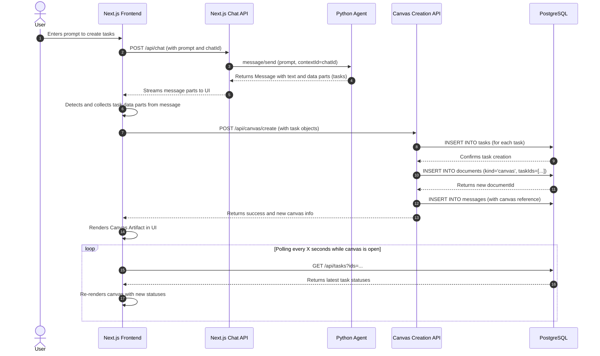

# Refactoring Plan: A2A Task & Canvas Flow

**Version:** 1.1
**Date:** 2025-08-30
**Last Updated:** 2025-01-27

### 1. Introduction & Goal

This document provides a detailed implementation plan for refactoring the application's task generation and canvas creation workflow. The primary goal is to adopt a more robust, client-driven architecture that properly separates the concerns between the external Python agent and the Next.js client application.

The previous implementation incorrectly coupled the agent to the client's internal state by having the client pre-create a `document` and pass its ID to the agent. The new flow reverses this, empowering the agent to simply return proposed tasks, leaving all database and document management responsibilities to the Next.js backend, triggered by the frontend.

### 2. The Refined Architecture

The core of this refactoring is a client-driven, two-step flow that leverages the Vercel AI SDK's ability to stream structured data. This ensures a clean separation of concerns and a more logical sequence of events.

#### 2.1. High-Level Flow

1.  **Intent to Agent**: The user provides a prompt in the UI. The Next.js Chat API (`/api/chat`) sends this prompt to the Python agent, ensuring the `chatId` is included to be used as the `contextId`.

2.  **Agent Response**: The Python agent interprets the prompt, generates one or more task objects, and returns a single A2A `Message` object. This message is multi-part, containing:
    - A `text` part with a human-readable confirmation message (e.g., "I have planned the following tasks.").
    - One or more custom `data` parts, where each part contains a full task object with its initial status set to `submitted`.

3.  **Frontend Handles Response**: The Next.js frontend, using the `useChat` hook, receives the streamed message from the Chat API. The UI layer is responsible for identifying and collecting the custom `data` parts that contain the task objects.

4.  **Client-Side Trigger**: After collecting all task objects from a single agent message, the frontend makes a **new, separate API call** to a dedicated endpoint in the Next.js backend (e.g., `/api/canvas/create`).

5.  **Backend Creates Canvas & Tasks**: This new, dedicated API endpoint receives the task objects and performs all necessary database transactions in one go:
    - It saves the tasks to the `tasks` table using the `createTask` query.
    - It creates a new `document` of `kind: 'canvas'` using the `saveDocument` query.
    - It links the newly created tasks to this canvas by storing their IDs in the document's `taskIds` JSONB field.
    - It saves a new message to the chat containing a reference to the canvas artifact, making it appear in the UI.

6.  **UI Renders Canvas & Polls for Updates**: The frontend UI renders the new canvas artifact. The canvas component then begins polling a backend endpoint periodically to fetch the latest statuses of its tasks. This allows the UI to reflect near-real-time updates (e.g., `submitted` -> `working` -> `completed`) as the agent executes the tasks and sends updates via webhooks.

#### 2.2. Sequence Diagram



### 3. Implementation Plan & Checklist

This plan is broken into three phases, starting with the backend, moving to the agent, and finishing with the frontend.

---

#### **Phase 1: Backend Refactoring (Next.js)**

**Goal**: Adapt the Next.js backend to support the new client-driven, two-step flow.

- [ ] **Task 1.1: Simplify the Chat API Route**
  - **File**: `app/(chat)/api/chat/route.ts`
  - **Action**: In the `POST` function, locate the `if (selectedChatModel === 'a2a-model')` block.
  - **REMOVE** the entire logic that pre-creates a `canvas` document, generates a `webhookToken`, and saves the document. This is no longer the responsibility of the chat route.
  - **MODIFY** the `a2a` provider configuration to only pass the `chatId` (as `contextId`). Remove the `documentId` and `pushNotificationConfig` from this initial call, as they are not needed for the agent's initial response.

- [ ] **Task 1.2: Create the Canvas & Task Creation API**
  - **File**: Create a new route at `app/api/canvas/create/route.ts`.
  - **Action**: Implement a `POST` handler that is well-documented and secure.
  - **Input**: The request body should be a JSON object containing `{ tasks: Task[], chatId: string }`.
  - **Authentication**: Ensure the handler checks for a valid user session.
  - **Logic**:
    1. Generate a single, secure `webhookToken` for this batch of tasks.
    2. Use `Promise.all` to call the `createTask` query from `lib/db/queries.ts` for each task object received. Ensure you save the `webhookToken` with each task.
    3. Collect the IDs of the newly created tasks.
    4. Call `saveDocument` to create a new `canvas` document. The document's `title` can be generic (e.g., "Task Plan"), and its `taskIds` field should be populated with the collected task IDs.
    5. Call `saveMessages` to insert a new message into the database for the specified `chatId`. This message should contain the reference to the new canvas artifact so it appears in the chat history.
    6. Return a `201 Created` response with the newly created canvas document object.

- [ ] **Task 1.3: Update the A2A Provider to Handle Task Data**
  - **File**: `lib/ai/a2a-chat-language-model.ts`
  - **Action**: Modify the `StreamProcessor` class inside the `createStreamFromA2A` method.
  - **Logic**: In the `processMessageParts` method, add a condition to detect if a part is a custom task object (e.g., `part.kind === 'data' && part.data.type === 'task'`). When a task part is detected, it should be transformed and enqueued as a custom UI message part that the frontend can uniquely identify, for example: `controller.enqueue({ type: 'data-task', data: part.data.task });`.

---

#### **Phase 2: Python Agent Refactoring**

**Goal**: Make the agent a pure, stateless task generator that returns tasks in a single, structured response.

- [ ] **Task 2.1: Refactor Agent's `execute` Method**
  - **File**: `python-agent/task_agent/agent_executor.py`
  - **Action**: Heavily simplify the `execute` and `_process_request_async` methods.
  - **REMOVE** all logic that looks for a `document_id` or calls webhooks during the initial task generation phase. The agent's job is now stateless in this initial step.

- [ ] **Task 2.2: Implement the New Response Format**
  - **File**: `python-agent/task_agent/agent_executor.py`
  - **Action**: The agent must return a single `Message` object via the `event_queue`.
  - **Logic**:
    1. Generate the list of job/task dictionaries based on the user's prompt.
    2. Construct a list of `Part` objects for the response.
    3. The first part should be a `TextPart` with a user-facing confirmation message.
    4. For each generated task, create a `DataPart`. The `data` payload should be a dictionary like `{ "type": "task", "task": { ...task_object... } }`. The task status must be `submitted`.
    5. Use the `event_queue` to enqueue a single agent message containing this complete list of parts.

---

#### **Phase 3: Frontend Integration**

**Goal**: Empower the UI to drive the canvas creation flow and to poll for live status updates.

- [ ] **Task 3.1: Handle Task Data in the UI**
  - **File**: The main chat component (e.g., `components/chat.tsx` or a child component).
  - **Action**: Implement a `useEffect` hook that watches the `messages` array from `useChat`.
  - **Logic**:
    1. The hook will scan the last message from the assistant.
    2. If it finds parts with `type: 'data-task'`, it will collect all task objects from that single message.
    3. To prevent the API from being called multiple times for the same message, maintain a state of processed message IDs (e.g., `const [processedMessageIds, setProcessedMessageIds] = useState<Set<string>>(new Set());`).
    4. If new, unprocessed tasks are found, add the message ID to the processed set and fire a single `POST` request to the new `/api/canvas/create` endpoint.

- [ ] **Task 3.2: Implement Client-Side Polling for Status Updates**
  - **File**: The component responsible for rendering the canvas artifact (e.g., `components/artifact.tsx` or a new, dedicated canvas component).
  - **Action**: When the component mounts and displays a canvas containing `taskIds`, it should initiate polling.
  - **Logic**:
    1. Use a `useEffect` hook to set up a `setInterval` (e.g., every 5 seconds).
    2. The interval's callback will make a `GET` request to a task-fetching API endpoint (a new bulk endpoint like `/api/tasks?ids=...` would be most efficient) with the IDs of the tasks in the canvas.
    3. On receiving the latest task data, update the component's state, which will trigger a re-render of the tasks and their statuses.
    4. **Important**: Only stop polling when ALL tasks reach terminal states (`completed`, `failed`, `canceled`, `rejected`). Continue polling for `submitted`, `working`, `input-required`, `auth-required`, and `unknown` statuses.
    5. The `useEffect` hook's cleanup function **must** clear the interval using `clearInterval` when the component unmounts to prevent memory leaks and unnecessary API calls.

- [ ] **Task 3.3: Implement Session Token Flow**
  - **File**: Chat API route (`app/(chat)/api/chat/route.ts`).
  - **Action**: Generate and pass webhook token to A2A provider.
  - **Logic**:
    1. Generate a secure webhook token using `crypto.randomUUID()` or similar.
    2. Include this token in the `pushNotificationConfig` passed to the A2A provider.
    3. Store the token temporarily in the request context so it can be validated later.
    4. The A2A provider will include this token in the webhook URL configuration sent to the Python agent.

---

### 4. Critical Implementation Details

#### **4.1. A2A Provider Blocking Configuration (URGENT)**

**Current Issue:** The A2A provider is configured with `blocking: true`, preventing webhook pattern.

**Required Fix in `lib/ai/a2a-chat-language-model.ts`:**

```typescript
// ❌ Current (blocking)
configuration: { blocking: true }

// ✅ Required (non-blocking with webhook support)
configuration: {
  blocking: false, // Must be false for ACK + webhook pattern
  pushNotificationConfig: {
    url: this.settings.pushNotificationConfig.url,
    token: this.settings.pushNotificationConfig.token
  }
}
```

#### **4.2. Webhook Authentication Security**

**Missing Security Layer:** The PRD lacks detailed webhook authentication requirements.

**Required Implementation in `/api/webhook/tasks/route.ts`:**

```typescript
export async function POST(request: Request) {
  // Extract token from Authorization header
  const authHeader = request.headers.get("authorization");
  if (!authHeader?.startsWith("Bearer ")) {
    return Response.json({ error: "Missing token" }, { status: 401 });
  }

  const providedToken = authHeader.substring(7);

  // Validate against stored webhookToken
  const task = await db.select().from(tasks).where(eq(tasks.id, body.id));
  if (!task.length || task[0].webhookToken !== providedToken) {
    return Response.json({ error: "Invalid token" }, { status: 401 });
  }

  // Proceed with idempotent upsert...
}
```

#### **4.3. AI SDK v5 Message Handling**

**UIMessage vs ModelMessage Pattern:**

- Store conversations as `UIMessage[]` in database
- Convert to `ModelMessage[]` only for model calls using `convertToModelMessages()`
- Handle streaming data parts with custom types like `data-canvasReference`

**Task Data Streaming:**

```typescript
// In StreamProcessor.processMessageParts()
if (part.kind === "data" && part.data?.type === "task") {
  controller.enqueue({
    type: "data-task",
    data: part.data.task,
  });
}
```

#### **4.4. Frontend Polling Strategy**

**Recommended Pattern for Handling Multiple Task Statuses:**

```typescript
const [taskStatuses, setTaskStatuses] = useState<Map<string, TaskStatus>>();
const [pollingInterval, setPollingInterval] = useState<NodeJS.Timeout>();

useEffect(() => {
  if (canvas?.taskIds?.length) {
    const interval = setInterval(async () => {
      try {
        const responses = await Promise.all(
          canvas.taskIds.map((id) => fetch(`/api/tasks/${id}`))
        );

        const statusMap = new Map();
        const allTerminal = responses.every((res) => {
          const status = res.data.status;
          statusMap.set(canvas.taskIds[i], res.data);
          // Only these statuses are terminal
          return ["completed", "failed", "canceled", "rejected"].includes(
            status
          );
        });

        setTaskStatuses(statusMap);

        // Stop polling only when ALL tasks are in terminal states
        if (allTerminal) {
          clearInterval(interval);
        }
      } catch (error) {
        console.error("Polling error:", error);
      }
    }, 5000);

    setPollingInterval(interval);

    return () => clearInterval(interval);
  }
}, [canvas?.taskIds]);
```

#### **4.5. Session Token Management**

**Token Flow Architecture:**

```typescript
// 1. Chat API generates token and passes to A2A provider
const webhookToken = crypto.randomUUID();
const provider = a2a(agentUrl, {
  pushNotificationConfig: {
    url: `${process.env.NEXT_PUBLIC_BASE_URL}/api/webhook/tasks`,
    token: webhookToken
  }
});

// 2. A2A provider includes token in message to Python agent
configuration: {
  blocking: false,
  pushNotificationConfig: {
    url: pushNotificationConfig.url,
    token: pushNotificationConfig.token  // ← This token
  }
}

// 3. Python agent stores token and uses it for webhook calls
// When task completes, agent calls:
response = requests.post(
  pushNotificationConfig.url,
  json=payload,
  headers={
    "Authorization": f"Bearer {pushNotificationConfig.token}",
    "Content-Type": "application/json"
  }
);
```

#### **4.6. Task Status Handling**

**Terminal vs Non-Terminal Statuses:**

**Terminal States (Stop Polling):**

- `completed` - Task finished successfully
- `failed` - Task encountered an error
- `canceled` - Task was canceled by user/agent
- `rejected` - Task was rejected

**Non-Terminal States (Continue Polling):**

- `submitted` - Task created, waiting to start
- `working` - Task is actively being processed
- `input-required` - Task needs user input
- `auth-required` - Task needs authentication
- `unknown` - Status unclear, continue monitoring

**Implementation:**

```typescript
const isTerminalStatus = (status: TaskStatus): boolean => {
  return ["completed", "failed", "canceled", "rejected"].includes(status);
};

const shouldStopPolling = (taskStatuses: TaskStatus[]): boolean => {
  return taskStatuses.every((status) => isTerminalStatus(status));
};
```

#### **4.7. Error Handling and Recovery**

**Webhook Failure Scenarios:**

- Network timeouts: Implement retry logic with exponential backoff
- Invalid tokens: Return 401 and log security events
- Database conflicts: Use optimistic locking with version fields
- Agent failures: Surface to UI with retry options

**Frontend Recovery:**

- Connection lost: Show offline indicator and retry button
- Partial failures: Allow individual task retries
- Timeout handling: Auto-cancel after configurable timeout

---

### 5. Priority Implementation Order

#### **Phase 0: Critical Fixes (Do These First)**

1. **URGENT**: Fix A2A Provider `blocking: true` → `blocking: false`
   - **File**: `lib/ai/a2a-chat-language-model.ts`
   - **Impact**: Without this, the entire webhook pattern won't work

2. **CRITICAL**: Implement proper webhook authentication
   - **File**: `/api/webhook/tasks/route.ts`
   - **Impact**: Security vulnerability without proper token validation

3. **HIGH**: Remove canvas pre-creation from chat API
   - **File**: `app/(chat)/api/chat/route.ts`
   - **Impact**: Violates client-driven architecture

#### **Phase 1: Backend Infrastructure**

4. **HIGH**: Create `/api/canvas/create` endpoint
   - Generate secure webhook tokens
   - Implement database transactions
   - Add proper authentication

5. **MEDIUM**: Update A2A provider for task data streaming
   - **File**: `lib/ai/a2a-chat-language-model.ts`
   - Handle `data-task` message parts

6. **MEDIUM**: Implement session token flow
   - Generate tokens in chat API
   - Pass to A2A provider
   - Store for webhook validation

#### **Phase 2: Python Agent Updates**

7. **HIGH**: Refactor Python agent to stateless task generator
   - **File**: `python-agent/task_agent/agent_executor.py`
   - Remove webhook calls from initial response
   - Return structured task data parts

8. **MEDIUM**: Update webhook notifications in Python agent
   - Use session tokens from initial request
   - Implement proper A2A webhook format

#### **Phase 3: Frontend Integration**

9. **HIGH**: Implement task data collection in UI
   - Detect `data-task` message parts
   - Collect and process task objects
   - Call canvas creation API

10. **MEDIUM**: Implement smart polling strategy
    - Handle multiple task statuses correctly
    - Only stop polling on terminal states
    - Proper cleanup and error handling

11. **LOW**: Add error recovery mechanisms
    - Connection lost indicators
    - Retry buttons for failed tasks
    - Timeout handling

---

### 6. Testing Strategy

#### **Unit Tests**

- Webhook authentication and token validation
- Task status transformation functions
- Message part processing logic

#### **Integration Tests**

- End-to-end task creation flow
- Webhook notifications from Python agent
- Frontend polling and status updates

#### **E2E Tests**

- Complete user journey: prompt → tasks → canvas → completion
- Error scenarios: network failures, invalid tokens
- Multiple task status transitions

---

### 7. Migration Considerations

#### **Database Migrations**

- Ensure all existing tasks have `webhookToken` values
- Migrate any existing canvas documents to use `taskIds` array
- Add indexes for performance on frequently queried fields

#### **Backward Compatibility**

- Support existing task creation patterns during transition
- Graceful degradation if webhook fails
- Fallback to synchronous polling if needed

#### **Environment Variables**

- `A2A_WEBHOOK_BASE_URL` - Base URL for webhook endpoints
- `A2A_WEBHOOK_TOKEN_TTL` - Token expiration time
- `TASK_POLLING_INTERVAL` - Frontend polling frequency
