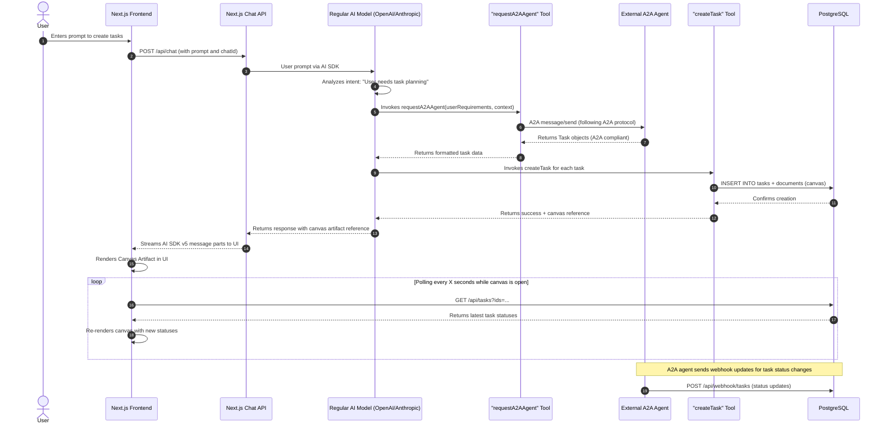

# Refactoring Plan: A2A Task & Canvas Flow - Tool-Based Architecture

**Version:** 2.0
**Date:** 2025-01-27
**Last Updated:** 2025-01-27

### 1. Introduction & Goal

This document provides a detailed implementation plan for refactoring the application's task generation and canvas creation workflow. The primary goal is to adopt a **tool-based architecture** that simplifies model selection while maintaining proper separation between AI SDK v5 standards (client-side) and A2A protocol compliance (external agent).

**Key Changes from Previous Approach:**

- **Always use regular AI models** (OpenAI, Anthropic, etc.) as the primary agent
- **Add "A2A Request" tool** that pipes specific requests to external A2A agent
- **Let the client agent decide** when to use external A2A agent based on user intent
- **Maintain AI SDK v5 patterns** throughout the client-side implementation
- **Keep A2A agent pure** and focused only on task generation/execution

### 2. The New Tool-Based Architecture

The core of this refactoring is a **tool-based approach** where a regular AI model (client agent) uses an "A2A Request" tool to communicate with external A2A agents when needed. This maintains AI SDK v5 patterns while enabling A2A protocol compliance.

#### 2.1. High-Level Flow

1.  **User Request**: User provides a prompt in the UI. The Next.js Chat API (`/api/chat`) always uses a **regular AI model** (OpenAI, Anthropic, etc.) with standard AI SDK v5 patterns.

2.  **Client Agent Analysis**: The regular AI model analyzes the user's intent and determines if it needs external task planning/execution capabilities.

3.  **Tool Invocation**: When task planning is needed, the client agent invokes the **"requestA2AAgent" tool** with the user's requirements and context.

4.  **A2A External Agent Call**: The tool implementation:
    - Calls the external A2A agent using existing A2A client code
    - Passes user requirements in A2A protocol format
    - Receives task objects back from A2A agent

5.  **Tool Result Processing**: The tool returns the A2A tasks to the client agent, which then:
    - Uses existing tools (`createTask`, `saveDocument`) to store tasks and create canvas
    - Generates appropriate user-facing response
    - Creates canvas artifact reference in the chat

6.  **UI Rendering**: Frontend displays the canvas artifact and begins polling for task status updates via webhooks.

#### 2.2. Sequence Diagram (Tool-Based Architecture)



### 3. Implementation Plan & Checklist (Tool-Based Architecture)

This plan focuses on implementing the new tool-based architecture where regular AI models use an "A2A Request" tool to communicate with external agents.

---

#### **Phase 1: Simplify Chat API & Remove Model Selection Logic**

**Goal**: Remove complex model selection logic and always use regular AI models.

- [x] **Task 1.1: Simplify Chat API Route** ✅ COMPLETED
  - **File**: `app/(chat)/api/chat/route.ts`
  - **Action**: Simplified to always use regular model provider with tool-based approach
  - **REMOVED**: A2A model branching logic from schema and system prompts
  - **IMPLEMENTED**: Consistent tool handling with `requestA2AAgent` tool integrated
  - **RESULT**: Clean architecture where client agent decides when to use A2A via tools

- [x] **Task 1.2: Create "A2A Request" Tool** ✅ COMPLETED
  - **File**: `lib/ai/tools/request-a2a-agent.ts`
  - **Action**: Implemented integrated tool that handles complete A2A workflow
  - **Implementation**: Tool communicates with external A2A agent first, then creates canvas only after successful task extraction

- [x] **Task 1.3: Implement A2A Tool Logic** ✅ COMPLETED
  - **File**: `lib/ai/tools/request-a2a-agent.ts`
  - **Action**: Complete A2A integration with proper task extraction
  - **Features**:
    1. Calls external A2A agent first (no premature document creation)
    2. Formats A2A message with context and metadata
    3. Uses `A2AClient.sendMessage()` to communicate with external agent
    4. Extracts task objects from A2A response artifacts
    5. Creates canvas document ONLY after successful task extraction
    6. Creates tasks in database and links to canvas document
    7. Returns complete workflow result with canvas reference

#### **Phase 2: Update Existing Tools for A2A Integration**

**Goal**: Ensure existing tools work seamlessly with the new A2A tool in the workflow.

- [ ] **Task 2.1: Update createTask Tool**
  - **File**: `lib/ai/tools/create-task.ts` (if exists) or create new
  - **Action**: Ensure it can handle A2A task objects from the requestA2AAgent tool
  - **Logic**:
    1. Accept task objects with A2A-compliant structure
    2. Generate webhook tokens for each task
    3. Store tasks in database using `createTask` query
    4. Return task IDs and canvas reference for client agent

- [ ] **Task 2.2: Update saveDocument Tool**
  - **File**: `lib/ai/tools/save-document.ts` (if exists) or create new
  - **Action**: Allow canvas creation with task references
  - **Logic**:
    1. Create canvas documents with `kind: 'canvas'`
    2. Link task IDs to document via `taskIds` field
    3. Generate appropriate artifact references for chat history

---

#### **Phase 3: External A2A Agent Compatibility**

**Goal**: Ensure the external A2A agent remains A2A protocol compliant.

- [ ] **Task 3.1: Maintain A2A Protocol Compliance**
  - **File**: `python-agent/task_agent/agent_executor.py`
  - **Action**: Keep existing A2A message/response format
  - **NO CHANGES**: The external agent should continue working as-is
  - **RESULT**: Pure A2A agent focused only on task generation

- [ ] **Task 3.2: Webhook Integration**
  - **File**: External agent webhook logic
  - **Action**: Ensure webhook notifications continue to work
  - **RESULT**: Task status updates flow back to client via webhooks

---

### 4. Benefits of Tool-Based Architecture

#### 4.1. **Simplified Model Selection**

- **Before**: Complex branching logic deciding between regular models and A2A models
- **After**: Always use regular models (OpenAI, Anthropic, etc.) with consistent AI SDK v5 patterns
- **Benefit**: Eliminates model selection complexity and edge cases

#### 4.2. **Intelligent Agent Decision Making**

- **Before**: Pre-determined that certain requests go to A2A agent
- **After**: Client agent analyzes user intent and decides when to use external A2A agent
- **Benefit**: More flexible and contextually appropriate tool usage

#### 4.3. **Standards Compliance**

- **Client Side**: Maintains full AI SDK v5 compliance throughout
- **External Agent**: Maintains pure A2A protocol compliance
- **Benefit**: Best of both worlds without compromise

#### 4.4. **Cleaner Separation of Concerns**

- **Client Agent**: Handles conversation, intent analysis, and database operations
- **A2A Agent**: Focused purely on task planning and execution
- **Benefit**: Easier maintenance, testing, and debugging

#### 4.5. **Tool Composition**

- Client agent can combine A2A requests with other tools seamlessly
- Can use multiple tools in sequence: A2A → createTask → saveDocument
- **Benefit**: More powerful and flexible workflows

---

### 5. Critical Implementation Details

#### **5.1. Tool Schema Design**

**Tool Name**: `requestA2AAgent`

**Description**: "Send requests to external A2A agent for complex task planning and execution. Use this tool when the user needs multi-step workflows, task decomposition, or automated execution. Examples: 'Plan and execute a data migration', 'Create a multi-stage deployment process', 'Break down a complex project into manageable tasks'."

**Parameters**:

```typescript
{
  userRequirements: {
    type: "string",
    description: "Detailed description of what the user wants accomplished, including context, constraints, and expected outcomes"
  },
  contextId: {
    type: "string",
    description: "Chat/session context identifier for maintaining conversation continuity"
  },
  urgency: {
    type: "string",
    enum: ["low", "medium", "high"],
    description: "Priority level for task execution (optional, default: medium)"
  }
}
```

#### **5.2. A2A Integration Pattern**

**Tool Implementation Strategy**:

1. **Input Processing**: Convert tool parameters to A2A `Message` format
2. **A2A Client**: Use existing `A2AClient` with non-blocking configuration
3. **Response Processing**: Parse A2A tasks and format for client agent
4. **Error Handling**: Graceful fallback and timeout handling

**A2A Client Configuration** (used by tool):

```typescript
// In the requestA2AAgent tool implementation
const client = new A2AClient(process.env.A2A_AGENT_URL);
const response = await client.sendMessage({
  message: {
    kind: "message",
    messageId: generateId(),
    role: "user",
    parts: [{ kind: "text", text: userRequirements }],
    contextId: contextId,
  },
  configuration: {
    blocking: false, // Non-blocking for webhook pattern
    acceptedOutputModes: ["text/plain", "application/json"],
    pushNotificationConfig: {
      url: `${process.env.NEXT_PUBLIC_BASE_URL}/api/webhook/tasks`,
      token: webhookToken,
    },
  },
});
```

#### **5.3. Task Data Flow**

**A2A Agent Response → Client Agent**:

```typescript
// A2A agent returns tasks in this format
{
  kind: "task",
  id: "task-uuid",
  status: { state: "submitted", timestamp: "..." },
  artifacts: [{
    artifactId: "artifact-uuid",
    parts: [{
      kind: "data",
      data: {
        type: "task",
        task: {
          id: "task-uuid",
          title: "Task Title",
          description: "Task Description",
          status: "submitted",
          contextId: "chat-context-id",
          webhookToken: "webhook-token-uuid"
        }
      }
    }]
  }]
}
```

---

### 6. Next Steps

This tool-based architecture provides a cleaner, more maintainable approach to integrating A2A agents while preserving the strengths of both AI SDK v5 and A2A protocol standards. The implementation should proceed in the phases outlined above, starting with simplifying the chat API and implementing the core A2A request tool.
